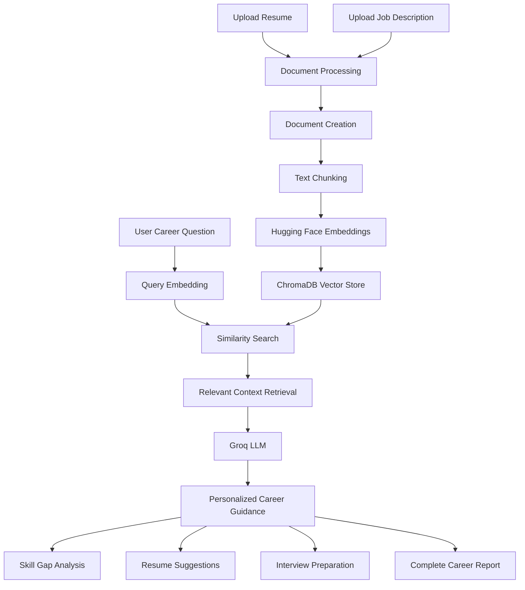

# 🎯 AI Career Coach – Intelligent Resume & ATS Assistant

An AI-powered career guidance application that uses **Retrieval-Augmented Generation (RAG)** to analyze resumes against job descriptions, identify skill gaps, suggest resume improvements, and generate interview preparation guidance.

The application uses a traditional RAG pipeline with LangChain, Hugging Face embeddings, ChromaDB, and Groq LLM integration to provide context-aware career assistance.

## 🚀 Live Demo

**[Try AI Career Coach](https://genai-intelligent-resume-ats-assistant.streamlit.app/)**

## 📌 Project Overview

Finding the right job and understanding the skills required for a particular role can be challenging.

AI Career Coach helps users evaluate their career readiness by comparing their resume with a target job description and generating personalized recommendations based on retrieved document context.

Users can upload their resume and job description or paste the text directly to receive AI-powered career insights.

## ✨ Features

* **Resume Analysis:** Upload resumes in PDF, DOCX, or TXT format.
* **Job Description Analysis:** Upload or paste a target job description.
* **RAG-Based Retrieval:** Retrieve relevant information from resume and job description documents.
* **Skill Gap Analysis:** Identify skills that may be missing for the target role.
* **Resume Improvement:** Receive suggestions to improve resume relevance.
* **Project Recommendations:** Get project ideas aligned with identified skill gaps.
* **Interview Preparation:** Generate interview questions based on the target role.
* **Interactive Career Assistant:** Ask custom career-related questions.
* **Complete Career Report:** Generate a consolidated career guidance report.
* **Retrieval Transparency:** Inspect the document chunks used to generate responses.
* **Configurable RAG Pipeline:** Adjust chunk size and overlap.

## 🛠️ Tech Stack

| Category               | Technologies                 |
| ---------------------- | ---------------------------- |
| Programming Language   | Python                       |
| Frontend               | Streamlit                    |
| LLM Framework          | LangChain                    |
| LLM                    | Groq                         |
| Embeddings             | Hugging Face                 |
| Vector Database        | ChromaDB                     |
| Document Processing    | PyPDF, python-docx, docx2txt |
| Environment Management | python-dotenv                |
| Deployment             | Streamlit Community Cloud    |

## 🧠 System Architecture



## ⚙️ How It Works

1. **Document Loading:** Resume and job description are uploaded or entered as text.
2. **Document Creation:** The input documents are converted into LangChain document objects.
3. **Text Chunking:** Documents are split into smaller chunks using `RecursiveCharacterTextSplitter`.
4. **Embedding Generation:** Hugging Face models convert text chunks into vector representations.
5. **Vector Storage:** The embeddings are stored in ChromaDB.
6. **Similarity Search:** Relevant chunks are retrieved based on the user's question.
7. **LLM Response Generation:** Groq's Llama model generates context-aware career guidance using the retrieved information.
8. **Career Insights:** Users receive skill gap analysis, resume suggestions, project ideas, interview questions, and a complete career report.

## 📂 Project Structure

```text
Ai_career_coach/
│
├── app.py
├── requirements.txt
├── README.md
│
└── src/
    ├── file_utils.py
    └── rag_engine.py
```

## 💻 Run Locally

### Prerequisites

* Python 3.10+
* Git
* Groq API Key

### 1. Clone the Repository

```bash
git clone https://github.com/praveenadurga135-commits/Ai_career_coach.git
```

### 2. Navigate to the Project

```bash
cd Ai_career_coach
```

### 3. Create a Virtual Environment

```bash
python -m venv venv
```

Activate it on Windows:

```bash
venv\Scripts\activate
```

### 4. Install Dependencies

```bash
pip install -r requirements.txt
```

### 5. Configure Environment Variables

Create a `.env` file in the project root:

```env
GROQ_API_KEY=your_groq_api_key
```

Replace the placeholder with your own API key. Do not commit API keys to GitHub.

### 6. Run the Application

```bash
streamlit run app.py
```

The application will be available at:

```text
http://localhost:8501
```

## 📊 Example Use Cases

* Evaluate resume relevance for a target job.
* Identify technical skills to improve.
* Get suggestions for resume enhancement.
* Discover projects to strengthen a career profile.
* Prepare for role-specific technical interviews.
* Generate a consolidated career development report.

## 🔮 Future Enhancements

* Resume parsing with structured skill extraction.
* Downloadable career reports in PDF format.
* Resume-to-job match scoring.
* Personalized learning roadmaps.
* Support for multiple job descriptions.
* Enhanced career analytics and visualizations.

## 👩‍💻 Author

**Mandapaka Praveena Durga**

B.Tech – Computer Science and Engineering
Artificial Intelligence & Machine Learning

* GitHub: [@praveenadurga135-commits](https://github.com/praveenadurga135-commits)
* Project Repository: [AI Career Coach](https://github.com/praveenadurga135-commits/Ai_career_coach)
* Live Application: [AI Career Coach](https://genai-intelligent-resume-ats-assistant.streamlit.app/)

---

⭐ If you find this project useful, consider giving the repository a star.

**Built with Python, RAG, and Generative AI.**
